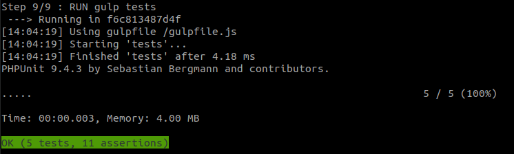
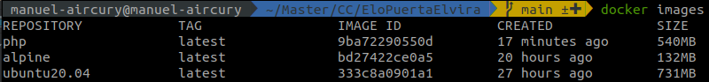

# Entrega 3

## Elección correcta y justificada del contenedor base.

En primer lugar, deseamos poder crear una imagen para poder realizar 
los tests en ella. Por las necesidades de nuestro proyecto, necesitamos 
construir una imagen en la que instalemos tanto PHP y los requerimientos
propios de las librerías que hemos ido utilizando. 
Además deberá de estar el gestor de tareas gulp. Para elegir el contenedor
que mejor se adapte a mis especificaciones, haré una serie de contenedores 
de prueba y optaré por la imagen que menos tamaño tenga.

+ En primer lugar hemos probado con una imagen de ubuntu 20.04. Al crear 
  la imagen, necesitábamos añadir gulp, y para instalar gulp necesitamos 
  npm. El primer problema que encontramos es que nos pedían en la 
  instalación la zona horaria, y para sortear este problema hemos 
  establecido la zona horaria al principio del Dockerfile para que no 
  tuviera que preguntar después la instalación. A parte de eso, 
  necesitamos también instalar php, ya que si no, los tests no podrían 
  correr. Al instalar php, en un momento nos piden que digamos y/n y para
  sortear este problema en la línea del apt-get ponemos un -y, que 
  evita que nos pregunte el instalador de php. Por último, tiramos los 
  tests con gulp para ver que todo esté correcto.
  
  Hemos creado un dockerfile para cada una de las imágenes que creamos. 
  El 
  [dockerfile](https://github.com/manuelorantes/EloPuertaElvira/tree/main/Dockerfiles/dockerfile_ubuntu20.04) 
  lo construimos por lo tanto con la siguiente línea,
  dando un nombre a la imagen y usando el archivo específico:
  `docker build -t ubuntu20.04 -f Dockerfiles/dockerfile_ubuntu20.04 .`y 
  se crea la imagen `ubuntu20.04`. Ahora está todo correcto porque 
  podemos ver al final de la ejecución del build que han pasado los tests 
  correctamente:
  
  

+ En segundo lugar, optamos por instalar `alpine`. La verdad es que haciendo 
  distintas imágenes, leí en una de las páginas que consulté que la imagen más 
  eficiente son las de alpine. Por lo tanto, en mi segunda opción decidí 
  probar con esta imagen, y lo primero que vemos es que no tiene apt, sino apk,
  con lo que vemos como cambia el 
  [dockerfile](https://github.com/manuelorantes/EloPuertaElvira/tree/main/Dockerfiles/dockerfile_ubuntu20.04).
  Ahora, ejecutamos la creación de la imagen con el siguiente comando:
  `docker build -t alpine -f Dockerfiles/dockerfile_alpine .` con la cual creamos
  la imagen `alpine`. Al igual que en el primer caso, también pasan los tests, por
  lo que la creación de la imagen ha sido un éxito.

+ Como tercera opción buscamos una imagen propia de php. En este caso, nos ahorramos 
  la instalación de php, pero necesitamos instalar npm para instalar gulp. De este modo, 
  el [dockerfile](https://github.com/manuelorantes/EloPuertaElvira/tree/main/Dockerfiles/dockerfile_php)
  se queda muy parecido al primero. Ya solo queda ejecutar la siguiente línea:
  `docker build -t php -f Dockerfiles/dockerfile_php .`, dando lugar a la imagen 
  `php`. Una vez que los tests pasan como en los primeros dos casos, ya podemos pasar
  a comparar las tres imágenes que hemos creado.
  
En primer lugar hacemos un `docker images` para ver el tamaño de las imágenes que hemos creado,
y este es el resultado:

Como podemos apreciar, la imagen con el menor tamaño es la segunda, la que generamos a partir
de un docker con alpine, y por lo tanto, es la que usaremos y la que a continuación pasaremos a 
optimizar ya en un `Dockerfile` en la raíz del proyecto.

## Dockerfile correcto, siguiendo buenas prácticas, y adaptado de forma correcta a las clases o módulos que se están testeando, incluyendo optimización del tamaño del mismo durante su construcción o a continuación
  